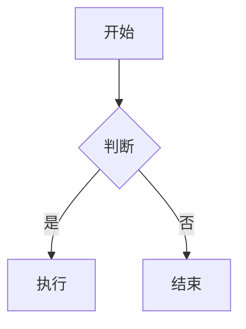
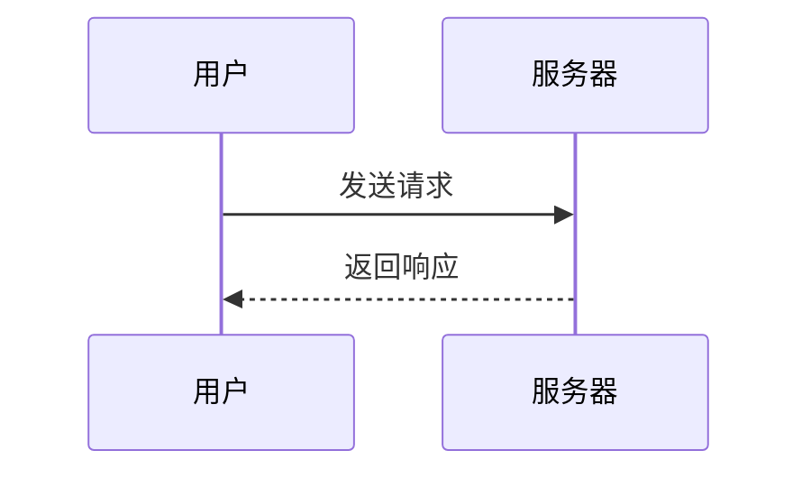

## 快速阅读

Markdown 是一种轻量级标记语言，由 John Gruber 于 2004 年创建。

它的核心思想可以用一句话概括：**让文档易于阅读、易于书写，同时可以转换为结构化的 HTML。**

### 主要特点

在 Markdown 出现之前，写网页内容通常要直接用 HTML，例如：

```html
<h1>整理书桌</h1>
<p>周末花了一个下午，把书桌重新整理了一遍，扔掉了<strong>不少东西</strong>。</p>
<ul>
  <li>过期的便签和收据</li>
  <li>用完的笔芯和空笔壳</li>
  <li>很久没翻开的旧杂志</li>
  <li>缠成一团的充电线</li>
</ul>
<p>桌面空出来之后，写东西的心情都好了很多。</p>
```

HTML 表达能力很强，但问题也很明显：

- 标签太多，写一段话要打一堆尖括号。
- 纯文本状态下难读，不渲染就看不清结构。

Markdown 用简单的符号代替了复杂的标签，例如：

```markdown
# 整理书桌

周末花了一个下午，把书桌重新整理了一遍，扔掉了**不少东西**。

- 过期的便签和收据
- 用完的笔芯和空笔壳
- 很久没翻开的旧杂志
- 缠成一团的充电线

桌面空出来之后，写东西的心情都好了很多。
```

相对于 HTML 来说，Markdown 的符号更少，结构更清晰，纯文本状态下也能阅读。

### 工作原理

Markdown 文件本质上是纯文本文件，扩展名通常为 `.md`，它本身不是最终展示，而是一种中间表达。

Markdown 的工作流程可以概括为：


flowchart LR
A[源文件.md] --> B[Markdown 解析器]
B --> C[HTML 文本]
C --> D[浏览器解析和渲染]


- 源文件：用 Markdown 语法编写的纯文本文件。
- 解析器：读取源文件并转换成对应的 HTML 标签。
- HTML：解析器输出的结构化网页代码。
- 页面渲染：浏览器把 HTML 渲染成最终看到的页面。

Markdown 是一种 **写作格式**，HTML 是一种 **展示格式**，前者负责好写，后者负责好看。


常见的 Markdown 解析器有 `marked`、`markdown-it`、`CommonMark` 等。


### 设计理念

**核心原则**

John Gruber 在设计 Markdown 时，规定了几个核心原则：

1. 可读性优先
   一份 Markdown 文档，即使不经过渲染，也应该能直接读懂。符号只是辅助，不会淹没内容本身。

2. 符号尽量少
   不需要像 HTML 那样为每个元素写开闭标签。`#` 就是标题，`-` 就是列表，`**` 就是加粗。

3. 兼容 HTML
   Markdown 允许直接嵌入 HTML。如果某个效果 Markdown 表达不了，可以直接写 HTML，两者可以混用。

4. 不追求完美
   Markdown 不试图覆盖所有排版需求。它只解决常用的部分：标题、段落、列表、链接、图片、代码、引用等。

可以概括为：让文档在源码状态下也保持可读，**把写作体验放在第一位**。

**MD 方言**

Markdown 没有严格的官方标准，因此出现了很多方言，在基础语法上做了扩展。

| 方言                            | 特点                       |
| :------------------------------ | :------------------------- |
| CommonMark                      | 最接近原始规范，有严格标准 |
| GFM（GitHub Flavored Markdown） | 支持表格、任务列表、删除线 |
| Markdown Extra                  | 支持脚注、定义列表、表格   |
| MultiMarkdown                   | 支持元数据、交叉引用       |

GFM 是目前最流行的方言，在 GitHub、掘金、CSDN 上看到的 Markdown，基本都遵循 GFM 规范。

### 局限性

Markdown 不是万能的，它也有边界：

- 排版控制弱：不能像 Word 那样精确控制字体、行距、页边距。
- 复杂表格吃力：合并单元格、跨行跨列，Markdown 支持有限。
- 不适合长文档：几十万字的文档，Markdown 的组织能力不如专业排版工具。
- 方言不一致：不同平台的支持程度和渲染效果可能有差异。

但作为技术文档、笔记记录的格式，Markdown 已经足够好用。

## 基本语法

基本语法是 Markdown 在设计之初定义的一组最核心的语法，几乎所有平台都支持。

### 标题

**MD 语法**

Markdown 支持两种标题语法：**ATX 风格** 和 **Setext 风格**。

ATX 风格：在文字前加 `#` 号，`#` 的数量代表标题层级（`1~6` 级）。

```markdown
# 一级标题

## 二级标题

### 三级标题

#### 四级标题

##### 五级标题

###### 六级标题
```


`#` 后加空格，这是最通用的规范写法。


Setext 风格：在文字下方使用 `=` 或 `-` 来标记标题（仅支持两级）。

```plaintext
一级标题
========

二级标题
--------
```


`=` 对应一级标题，`-` 对应二级标题，数量不限，写一个也可以。


**渲染效果**

参考本文的标题渲染效果。

**最佳实践**

- 优先使用 ATX 风格，因为支持 `1~6` 级，且写法更直观。
- 一篇文章只用一个一级标题，通常作为文档标题。
- 不要跳级，例如从 `##` 直接跳到 `####`，会破坏文档结构。
- 标题前后留空行，可避免解析歧义（尤其 Setext 风格容易和正文混淆）。

### 换行

**MD 语法**

在 Markdown 中，一个或多个连续的文本行，中间没有空行，会被视为同一个 **段落**。

用一个空行分隔，即可将文本划分成两个独立的段落。

```markdown
这是第一段。

这是第二段。
```


空行等于分段，没有空行，文本就会被合并成同一个段落。


在行尾加两个空格，或者在行尾加反斜杠 `\`，可以强制换行。

```markdown
这是第一行
这是第二行

这是第一行\
这是第二行
```


单个回车 `Enter` 通常不会产生真正的换行效果，多数解析器会把它们合并成同一行。


**渲染效果**

这是第一段。

这是第二段。

这是第一行  
这是第二行

这是第一行\
这是第二行

**最佳实践**

- 行尾空格在编辑器里看不见、容易被自动删除，所以更推荐用 `\` 来强制换行。
- 不要为了排版美观手动换行，长句交给渲染器自动折行即可。
- 不要用缩进代替分段，Markdown 靠空行实现分段。
- 表格、列表、代码块内部不要用强制换行，这些结构有自己的换行规则。

### 强调

**MD 语法**

Markdown 支持两种强调语法：**斜体** 和 **加粗**，通过在文字两侧添加符号实现。

斜体：在文字两侧各加一个 `*` 或 `_`。

```plaintext
*斜体文字*
_斜体文字_
```


`*` 和 `_` 效果相同，选择一种即可，推荐用 `*`。


粗体：在文字两侧各加两个 `*` 或 `_`。

```plaintext
**粗体文字**
__粗体文字__
```

粗体 + 斜体：在文字两侧各加三个 `*` 或 `_`。

```plaintext
***加粗并斜体***
___加粗并斜体___
```


符号和文字之间不要加空格，否则解析器不会识别为强调语法。


**渲染效果**

_斜体文字_
_斜体文字_

**粗体文字**
**粗体文字**

**_加粗并斜体_**
**_加粗并斜体_**

**最佳实践**

- 一段文字中不要叠加过多强调，否则会丢失重点。
- 中文强调优先用加粗，斜体在中文排版里可读性较差。
- 不要混用加粗和斜体，会导致视觉上看不出主次。
- 不要用强调代替标题或列表，结构问题应该用结构语法解决。

### 列表

**MD 语法**

Markdown 支持两种列表：**有序列表** 和 **无序列表**，它们可以互相嵌套。

无序列表：在文字前加 `-`、`*` 或 `+`。

```markdown
- 第一项
- 第二项
- 第三项
```


`-` `*` `+` 效果相同，选择一种即可，推荐用 `-`，不易和强调符号混淆。


有序列表：在文字前加数字和 `.`。

```markdown
1. 第一项
2. 第二项
3. 第三项
```

嵌套列表：在子项前加缩进（通常为 `2` 个空格，或一个 `Tab`）。

```markdown
- 第一项
  - 子项一
  - 子项二
- 第二项
  - 子项一
```


同一层级的子项缩进量必须一致，否则会导致格式解析错误。


**渲染效果**

- 第一项
- 第二项
- 第三项

1. 第一项
2. 第二项
3. 第三项

- 第一项
  - 子项一
  - 子项二
- 第二项
  - 子项一

**最佳实践**

- 符号和文字之间加一个空格，紧贴文字可能不会被识别为列表。
- 列表前后需要留空行，避免和正文、标题粘连导致解析错误。
- 列表项内容较长时，续行也要保持缩进对齐，否则会脱离列表。
- 列表项内容复杂时，应该用空行隔开，简单列表项之间不用留空行。

### 引用

**MD 语法**

Markdown 使用 `>` 表示引用。

在每一行的文字前加一个 `>`。

```markdown
> 这是引用的第一行。
> 这是引用的第二行。
```


`>` 只对第一行生效，后续行会脱离引用，因此每行内容都要带 `>`。


引用可以嵌套，用多个 `>` 表示不同的层级。

```markdown
> 第一层引用
>
> > 第二层引用
```


引用内的空行也要写 `>`，空一行会中断引用。


引用内部可以使用其他语法，在 `>` 后可以写标题、列表、代码等。

```plaintext
> 这是一段引用文字，里面有 **加粗** 和 *斜体*。
>
> 1. 引用中的列表项
> 2. 第二项
>
> `inline code`
```

**渲染效果**

> 这是引用的第一行。
> 这是引用的第二行。

> 第一层引用
>
> > 第二层引用

> 这是一段引用文字，里面有 **加粗** 和 _斜体_。
>
> 1. 引用中的列表项
> 2. 第二项
>
> `inline code`

**最佳实践**

- `>` 后加一个空格，是最通用的规范写法。
- 嵌套引用不要超过两层，层级过多可读性差。
- 嵌套引用中，每个 `>` 后面都应该跟一个空格，写成 `> >` 是更标准的形式。
- 不要在引用里嵌套过于复杂的结构，这种情况应该考虑别的渲染形式。

### 图片

**MD 语法**

Markdown 使用 `` 插入图片。

`` 结构中，`!` 是图片标记，`[]` 是替代文字，`()` 是图片的路径或链接。

```markdown

```


图片标题是鼠标悬停在图片上时显示的提示文字，可以省略。


**渲染效果**


**最佳实践**

- 尽量不要省略替代文字，图片加载失败时会显示它。
- 优先使用相对路径引用本地图片，方便文档和图片一起迁移。
- 使用网络图片时确认可长期访问，避免外链失效导致图片加载失败。
- 控制图片体积，必要时先压缩再引用，避免加载时间过长。

### 链接

**MD 语法**

Markdown 使用 `[链接文字](链接地址 "链接标题")` 插入链接。

`[]()` 结构中，`[]` 是链接显示的文字，`()` 是跳转地址。

```markdown
[CommonMark 规范](https://commonmark.org "CommonMark 官方网站")
```


链接标题是鼠标悬停在链接上时显示的提示文字，可以省略。


**自动链接** 写法：直接用尖括号包住 URL 或邮箱。

```markdown
<https://example.com>
<name@example.com>
```


自动链接写法会把地址本身作为显示文字，适合直接给出网址的场景。


**引用式链接** 写法：把地址单独定义，正文里只写标记 `[链接文字][id]`。

```markdown
[链接文字][id]

[id]: https://example.com "链接标题"
```


引用式链接适合同一地址在文中多次使用的场景，改地址时只需改一处。


**渲染效果**

[CommonMark 规范](https://commonmark.org "CommonMark 官方网站")

<https://example.com>
<name@example.com>

[链接文字][id]

[id]: https://example.com "链接标题"

### 代码

**MD 语法**

Markdown 支持两种代码语法：**行内代码** 和 **代码块**。

行内代码：在文字两侧各加一个反引号 `` ` ``。

```markdown
这是 `inline code` 示例。
```


行内代码用于标记单行代码、命令、文件名或变量名，不会换行。


代码块：在代码前后各加三个反引号 ` ``` `，并在开头三个反引号后写上语言名，让语法能被高亮显示。

````markdown
```python
def greet(name):
    print(f"Hello, {name}!")

greet("World")
```
````


常见的语言名有 `javascript` `bash` `json` `html` `css` 等，可以省略，不写则没有语法高亮。



代码块内部嵌套代码块时，外层要用四个或更多反引号，否则会解析错乱。


**渲染效果**

这是 `inline code` 示例。

```python
def greet(name):
    print(f"Hello, {name}!")

greet("World")
```

### 分隔线

**MD 语法**

Markdown 使用三个或更多的 `-`、`*` 或 `_` 表示分隔线。

符号之间可以加空格，数量也可以超过三个。

```markdown
---
```


三种符号效果相同，选一种即可，推荐用 `---`。


**渲染效果**

---

## 扩展语法

扩展语法是由不同 Markdown 方言额外增加的功能，各平台的支持情况不一致。

### 表格

**MD 语法**

用 `|` 分隔单元格，用 `-` 分隔表头和内容。

```markdown
| 表头 | 表头 |
| ---- | ---- |
| 内容 | 内容 |
| 内容 | 内容 |
```


第二行的 `-` 是必需的，它是表格的语法标记，`-` 的数量不限。


对齐方式：在 `-` 两侧加 `:` 控制对齐。

```markdown
| 左对齐 | 居中 | 右对齐 |
| :----- | :--: | -----: |
| 内容   | 内容 |   内容 |
| 内容   | 内容 |   内容 |
```


单元格里可以写行内语法，如强调、行内代码、链接等。


**渲染效果**

| 表头 | 表头 |
| ---- | ---- |
| 内容 | 内容 |
| 内容 | 内容 |

| 左对齐 | 居中 | 右对齐 |
| :----- | :--: | -----: |
| 内容   | 内容 |   内容 |
| 内容   | 内容 |   内容 |

### 删除线

**MD 语法**

用两个 `~~` 包住文字，表示删除。

```markdown
~~这是删除的文字~~
```

可以和强调、行内代码等组合使用。

```markdown
~~**粗体文字**~~
~~`inline code`~~
```

**渲染效果**

~~这是删除的文字~~

~~**粗体文字**~~
~~`inline code`~~

### 任务列表

**MD 语法**

在无序列表项前加 `[ ]` 或 `[x]`，表示未完成或已完成。

```markdown
- [ ] 未完成的任务
- [x] 已完成的任务
```

任务列表也可以嵌套，和普通列表嵌套规则相同。

```markdown
- [ ] 主任务
  - [x] 子任务一
  - [ ] 子任务二
```

**渲染效果**

当前页面不支持渲染任务列表。

### 数学公式

**MD 语法**

用 `$...$` 表示行内公式，用 `$$...$$` 表示公式块。

```plaintext
行内公式：$E = mc^2$

公式块：
$$
a^2 + b^2 = c^2
$$
```


Markdown 只提供了 `$...$` 这个 **容器**，内部的语法是由 `LaTeX` 定义的，再由 `MathJax` / `KaTeX` 这类渲染引擎画成数学符号。


数学公式的 `LaTeX` 写法：

```markdown
上标：$x^2$

下标：$x_1$

分数：$\frac{a}{b}$

根号：$\sqrt{x}$

求和：$\sum_{i=1}^{n} x_i$

积分：$\int_{a}^{b} f(x)\,dx$

极限：$\lim_{x \to 0}$

希腊字母：$\alpha$ $\beta$ $\pi$ $\sigma$ $\omega$

不等于：$\neq$

小于等于：$\leq$

大于等于：$\geq$

向量：$\vec{a}$

矩阵：$\begin{pmatrix} a & b \\ c & d \end{pmatrix}$
```


数学公式属于第三方扩展，需要编辑器或平台支持 `MathJax` / `KaTeX` 才能渲染。


**渲染效果**

行内公式：$E = mc^2$

公式块：

$$
a^2 + b^2 = c^2
$$

上标：$x^2$

下标：$x_1$

分数：$\frac{a}{b}$

根号：$\sqrt{x}$

求和：$\sum_{i=1}^{n} x_i$

积分：$\int_{a}^{b} f(x)\,dx$

极限：$\lim_{x \to 0}$

希腊字母：$\alpha$ $\beta$ $\pi$ $\sigma$ $\omega$

不等于：$\neq$

小于等于：$\leq$

大于等于：$\geq$

向量：$\vec{a}$

矩阵：$\begin{pmatrix} a & b \\ c & d \end{pmatrix}$

### Mermaid 图表

**MD 语法**

用 ` ```mermaid ` 代码块包裹 Mermaid 语法，即可绘制图表。

````markdown

````

流程图：用 `graph` 声明方向，`-->` 表示箭头。

````markdown

````


`TD` 从上到下，`LR` 从左到右；`[]` 表示矩形，`{}` 表示菱形，`()` 表示圆角。


时序图：用 `sequenceDiagram` 声明。

````markdown

````


Mermaid 属于第三方扩展，需要编辑器或平台支持才能渲染，否则会原样显示为代码。


**渲染效果**


流程图


时序图


## 相关链接

1. [Markdown Guide - 基础语法](https://www.markdownguide.org/basic-syntax/ "MD 基础语法")
2. [Markdown Guide - 扩展语法](https://www.markdownguide.org/extended-syntax/ "MD 扩展语法")
3. [Markdown Guide - 速查表](https://www.markdownguide.org/cheat-sheet/ "MD 速查表")
4. [Markdown CN - 中文文档](https://markdown.com.cn/ "Markdown 教程")
